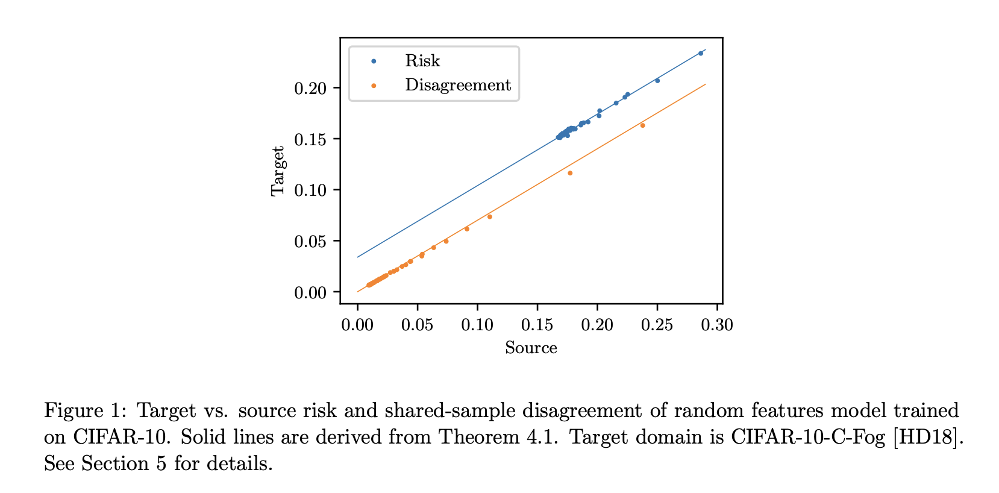

# [ICML 2023] Demystifying Disagreement-on-the-Line in High Dimensions
arXiv link: https://arxiv.org/abs/2301.13371

## Abstract

Evaluating the performance of machine learning models under distribution shifts is challenging, especially
when we only have 
unlabeled data from the shifted (target) domain,
along with labeled data from the original (source) domain.
Recent work suggests that the notion of disagreement, 
the degree to which two models trained with different randomness differ on the same input, is a key to tackling this problem. 
Experimentally, disagreement and prediction error have been shown to be strongly connected,
which has been used to estimate model performance.
Experiments have led to the discovery of the disagreement-on-the-line phenomenon, 
whereby the classification error under the target domain is often a linear function of the classification error under the source domain; 
and whenever this property holds, disagreement under the source and target domain follow the same linear relation.
In this work, we develop a theoretical foundation for analyzing disagreement in high-dimensional random features regression; 
and study under what conditions the disagreement-on-the-line phenomenon occurs in our setting. 
Experiments on CIFAR-10-C, Tiny ImageNet-C, and Camelyon17 are consistent with our theory and support the universality of the theoretical findings.



`experiments/simulations`: Section 3, 4\
`experiments/real_datasets`: Section 5


For the real-world dataset experiments, the datasets should be downloaded from:\
`CIFAR-10-C`: https://zenodo.org/record/2535967#.Y9hoeOzMI1M \
`Tiny ImageNet`: https://www.kaggle.com/c/tiny-imagenet \
`Tiny ImageNet-C`: https://zenodo.org/record/2469796#.Y9hoei-B1QI \
`CIFAR-10` and `Camelyon17` are downloaded from the packages `torchvision` and `wilds` (https://github.com/p-lambda/wilds)

Downloaded datasets should be placed as
```
experiments
---real_datasets
------data
---------CIFAR10
---------CIFAR10-C
---------TinyImageNet
---------TinyImageNet-C
---------camelyon17_v1.0
```
